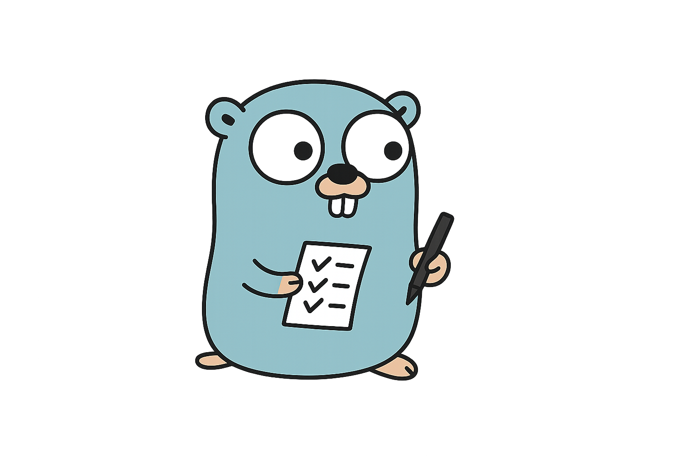

# Trello CLI for humans and LLMs

A comprehensive Trello CLI tool built in Go that provides full access to Trello's API with features optimized for LLM integration including context optimization, batch operations, and flexible output formats.

## Features

- **Comprehensive Operations**: Full CRUD operations on boards, lists, cards, labels, checklists, members, and attachments
- **LLM-Optimized Output**: Both Markdown and JSON formats with token counting and field filtering
- **Flexible Authentication**: Environment variables, config file, or command-line flags with precedence
- **Batch Operations**: Execute multiple operations from files or stdin for automation
- **Context Optimization**: Token limits, field filtering, and summarization for LLM use cases
- **Scripting Support**: Designed for automation and integration with LLM workflows

## Installation

### Prerequisites

- Trello API credentials (API key and token)

### Package Managers

#### Homebrew (macOS)

```bash
brew tap danbruder/tap
brew install trello-cli
```

#### Chocolatey (Windows)

```powershell
choco install trello-cli
```

#### APT (Debian/Ubuntu)

```bash
# Add the repository (when available)
curl -fsSL https://apt.danbruder.com/trello-cli/gpg | sudo gpg --dearmor -o /usr/share/keyrings/trello-cli-archive-keyring.gpg
echo "deb [arch=amd64 signed-by=/usr/share/keyrings/trello-cli-archive-keyring.gpg] https://apt.danbruder.com/trello-cli/ stable main" | sudo tee /etc/apt/sources.list.d/trello-cli.list
sudo apt update
sudo apt install trello-cli
```

#### YUM/DNF (Red Hat/CentOS/Fedora)

```bash
# Add the repository (when available)
sudo dnf config-manager --add-repo https://rpm.danbruder.com/trello-cli/trello-cli.repo
sudo dnf install trello-cli
```

### Manual Installation

#### Download Pre-built Binaries

1. Go to the [Releases page](https://github.com/danbruder/trello-cli/releases)
2. Download the appropriate binary for your platform:
   - `trello-cli-linux-amd64` for Linux x86_64
   - `trello-cli-linux-arm64` for Linux ARM64
   - `trello-cli-darwin-amd64` for macOS Intel
   - `trello-cli-darwin-arm64` for macOS Apple Silicon
   - `trello-cli-windows-amd64.exe` for Windows x86_64
   - `trello-cli-windows-arm64.exe` for Windows ARM64

3. Make it executable and move to your PATH:

```bash
# Linux/macOS
chmod +x trello-cli-*
sudo mv trello-cli-* /usr/local/bin/trello-cli

# Windows
# Move the .exe file to a directory in your PATH
```

#### Docker

```bash
# With environment variables
docker run --rm -it \
  -e TRELLO_API_KEY="your-api-key" \
  -e TRELLO_TOKEN="your-token" \
  ghcr.io/danbruder/trello-cli:latest board list

# Or with a config file
docker run --rm -it \
  -v ~/.trello-cli:/root/.trello-cli \
  ghcr.io/danbruder/trello-cli:latest board list
```

### Build from Source

```bash
git clone https://github.com/danbruder/trello-cli.git
cd trello-cli
go build -o trello-cli .
```

### Get Trello API Credentials

1. Go to [Trello Developer Portal](https://trello.com/app-key)
2. Copy your API Key
3. Generate a token with appropriate permissions
4. Set up authentication (see Authentication section below)

## Authentication

The CLI supports multiple authentication methods with the following precedence order:

1. **Environment Variables** (highest priority)
2. **Config File**
3. **Command-line Flags** (lowest priority)

### Environment Variables

```bash
export TRELLO_API_KEY="your-api-key"
export TRELLO_TOKEN="your-token"
```

### Config File

Create a config file at `~/.trello-cli/config.yaml`:

```yaml
api_key: your-api-key
token: your-token
default_format: markdown
max_tokens: 4000
```

Or use the config command:

```bash
trello-cli config set --api-key "your-api-key" --token "your-token"
```

### Command-line Flags

```bash
trello-cli --api-key "your-api-key" --token "your-token" board list
```

## Usage

### Basic Commands

#### Boards

```bash
# List all boards
trello-cli board list

# Get board details
trello-cli board get <board-id>

# Create a new board
trello-cli board create "My New Board"

# Delete a board
trello-cli board delete <board-id>

# Add member to board
trello-cli board add-member <board-id> user@example.com
```

#### Lists

```bash
# List all lists on a board
trello-cli list list --board <board-id>

# Get list details
trello-cli list get <list-id>

# Create a new list
trello-cli list create --board <board-id> "New List"

# Archive a list
trello-cli list archive <list-id>
```

#### Cards

```bash
# List all cards in a list
trello-cli card list --list <list-id>

# Get card details
trello-cli card get <card-id>

# Create a new card
trello-cli card create --list <list-id> "New Card"

# Move a card to another list
trello-cli card move <card-id> --list <target-list-id>

# Copy a card
trello-cli card copy <card-id> --list <target-list-id>

# Archive a card
trello-cli card archive <card-id>

# Delete a card
trello-cli card delete <card-id>
```

#### Labels

```bash
# List all labels on a board
trello-cli label list --board <board-id>

# Create a new label
trello-cli label create --board <board-id> --name "Important" --color "red"

# Add label to card
trello-cli label add <card-id> <label-id>
```

#### Checklists

```bash
# List all checklists on a card
trello-cli checklist list --card <card-id>

# Create a new checklist
trello-cli checklist create --card <card-id> "Task List"

# Add item to checklist
trello-cli checklist add-item <checklist-id> "Task Item"
```

#### Members

```bash
# Get member information
trello-cli member get <username-or-id>

# List member's boards
trello-cli member boards <username-or-id>
```

#### Attachments

```bash
# List all attachments on a card
trello-cli attachment list --card <card-id>

# Add attachment to card
trello-cli attachment add --card <card-id> <url>
```

### Output Formats

#### Markdown (Default)

```bash
trello-cli board list
# Outputs formatted Markdown tables and sections
```

#### JSON

```bash
trello-cli board list --format json
# Outputs structured JSON
```

### LLM Optimization Features

#### Field Filtering

```bash
# Only include specific fields
trello-cli card list --list <list-id> --fields name,desc,due

# Verbose output with all fields
trello-cli card get <card-id> --verbose
```

#### Token Limits

```bash
# Limit output to 2000 tokens
trello-cli board list --max-tokens 2000
```

#### Quiet Mode

```bash
# Minimal output for scripting
trello-cli card create --list <list-id> "New Card" --quiet
```

### Batch Operations

#### From File

Create a batch file `operations.json`:

```json
{
  "operations": [
    {
      "type": "card",
      "resource": "card",
      "action": "create",
      "data": {
        "name": "Task 1",
        "list_id": "list-id-1"
      }
    },
    {
      "type": "card",
      "resource": "card", 
      "action": "create",
      "data": {
        "name": "Task 2",
        "list_id": "list-id-2"
      }
    }
  ],
  "continue_on_error": true
}
```

Execute batch operations:

```bash
trello-cli batch file operations.json
```

#### From Stdin

```bash
cat operations.json | trello-cli batch stdin
```

### Configuration Management

```bash
# Show current configuration
trello-cli config show

# Set configuration values
trello-cli config set --api-key "key" --token "token" --default-format json

# Show config file path
trello-cli config path
```

## LLM Integration Examples

### Getting Board Context for LLM

```bash
# Get board summary with key information
trello-cli board get <board-id> --fields name,desc,url --format json

# Get all cards with essential fields
trello-cli card list --list <list-id> --fields name,desc,labels,due --format json --max-tokens 3000
```

### Batch Processing for LLM Workflows

```bash
# Process multiple operations from LLM-generated JSON
echo '{"operations":[{"type":"card","resource":"card","action":"create","data":{"name":"LLM Generated Task","list_id":"list-id"}}]}' | trello-cli batch stdin --format json
```

### Scripting Integration

```bash
#!/bin/bash
# Create cards from a list
while IFS= read -r task; do
    trello-cli card create --list "$LIST_ID" "$task" --quiet
done < tasks.txt
```

## Configuration Reference

### Config File Format

```yaml
api_key: your-trello-api-key
token: your-trello-token
default_format: markdown  # or json
max_tokens: 4000         # 0 = unlimited
```

### Environment Variables

- `TRELLO_API_KEY`: Your Trello API key
- `TRELLO_TOKEN`: Your Trello access token

### Global Flags

- `--api-key`: Override API key
- `--token`: Override token
- `--format, -f`: Output format (markdown, json)
- `--fields`: Comma-separated list of fields to include
- `--max-tokens`: Maximum tokens in output (0 = unlimited)
- `--verbose, -v`: Verbose output
- `--quiet, -q`: Quiet mode (minimal output)
- `--debug`: Debug mode (show API calls)

## Error Handling

The CLI provides detailed error messages and appropriate exit codes:

- `0`: Success
- `1`: General error
- `2`: Authentication error
- `3`: API error

## Contributing

1. Fork the repository
2. Create a feature branch
3. Make your changes
4. Add tests if applicable
5. Submit a pull request

## License

MIT License - see LICENSE file for details.

## Support

For issues and questions:

1. Check the [GitHub Issues](https://github.com/danbruder/trello-cli/issues)
2. Create a new issue with detailed information
3. Include your Go version, OS, and error messages

## Roadmap

- [ ] Webhook support
- [ ] Advanced filtering and search
- [ ] Export/import functionality
- [ ] Plugin system for custom operations
- [ ] Integration with popular LLM frameworks
- [ ] Real-time updates via WebSocket

